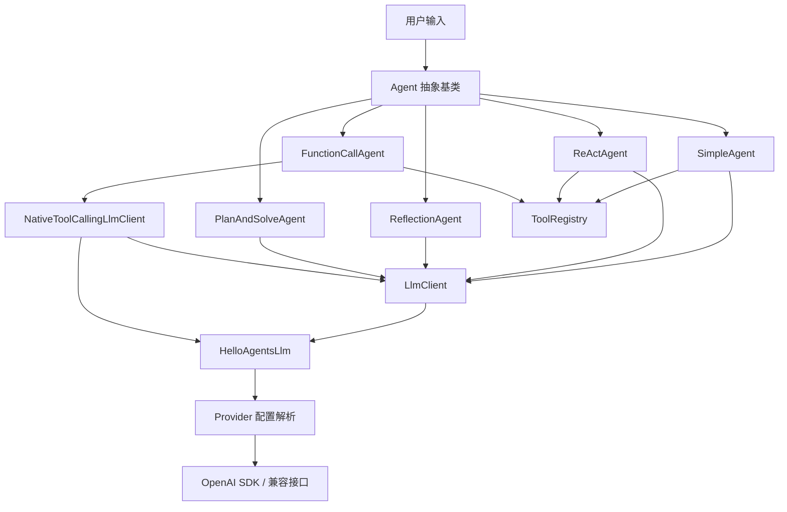
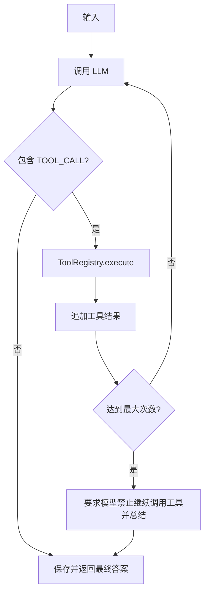
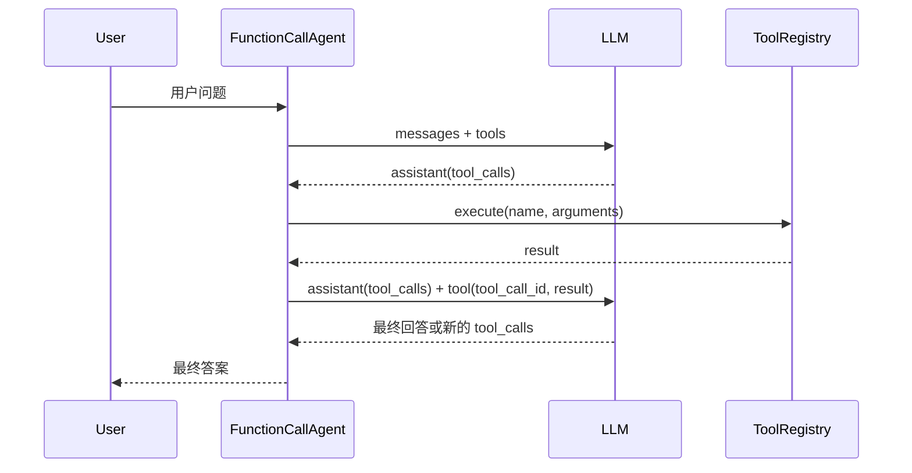

# 第七章 完整实现你的 Agent 框架

## 1. 本章目标

本章以 `chapter7/agent-patterns-ts` 为最终工程，使用 Node.js、TypeScript、OpenAI 兼容接口、Zod 和 Vitest，从零搭建一个可扩展的 Agent 框架。

完成后，框架具备以下能力：

- 统一的 LLM 调用接口，Agent 不直接依赖具体 SDK。
- OpenAI、DeepSeek、通义千问、ModelScope、Kimi、智谱、Ollama、vLLM 等多提供商配置。
- 普通调用、流式调用和原生 Function Calling。
- 统一的 `Message`、`Config`、`Agent` 框架接口。
- 带运行时参数校验的工具系统。
- Simple、ReAct、Reflection、Plan-and-Solve、FunctionCall 五种 Agent 范式。
- 不调用真实 API 的稳定单元测试。

这一章的重点不只是实现五个类，而是理解一个 Agent 框架如何分层：

```text
应用与示例
    ↓
Agent 范式层
    ↓
统一 Agent / Message / Config
    ↓
工具系统与结构化协议
    ↓
LLM 抽象与 Provider 适配
    ↓
OpenAI SDK 或兼容服务
```

---

## 2. 最终架构



核心设计原则如下：

1. Agent 面向接口编程，只依赖 `LlmClient`。
2. Provider、API Key、Base URL 和模型选择集中在 LLM 层。
3. 所有外部输入都先按照 `unknown` 处理，再由 Zod 校验。
4. 工具执行错误转换成 Observation，让 Agent 有机会自我修正。
5. 所有循环都必须有明确终止条件和最大次数限制。
6. 单元测试使用假模型，不依赖网络、API Key 和真实模型输出。

---

## 3. 最终目录结构

```text
chapter7/agent-patterns-ts/
├── .env.example
├── .gitignore
├── package.json
├── tsconfig.json
├── README.md
├── LEARNING_GUIDE.md
├── src/
│   ├── index.ts
│   ├── core/
│   │   ├── agent.ts
│   │   ├── config.ts
│   │   ├── errors.ts
│   │   ├── hello-agents-llm.ts
│   │   ├── json.ts
│   │   ├── llm-provider.ts
│   │   ├── llm-types.ts
│   │   ├── message.ts
│   │   ├── native-tool-calling.ts
│   │   ├── openai-llm.ts
│   │   └── types.ts
│   ├── tools/
│   │   ├── tool.ts
│   │   ├── calculator.ts
│   │   └── search.ts
│   ├── extensions/
│   │   └── my-llm.ts
│   ├── agents/
│   │   ├── simple/
│   │   │   └── simple-agent.ts
│   │   ├── react/
│   │   │   └── react-agent.ts
│   │   ├── reflection/
│   │   │   ├── memory.ts
│   │   │   ├── prompts.ts
│   │   │   ├── reflection-agent.ts
│   │   │   └── types.ts
│   │   ├── plan-and-solve/
│   │   │   ├── executor.ts
│   │   │   ├── plan-and-solve-agent.ts
│   │   │   ├── planner.ts
│   │   │   ├── prompts.ts
│   │   │   └── types.ts
│   │   └── function-call/
│   │       └── function-call-agent.ts
│   └── examples/
│       ├── llm-client-demo.ts
│       ├── my-llm-demo.ts
│       ├── simple-agent-demo.ts
│       ├── react-demo.ts
│       ├── reflection-demo.ts
│       ├── plan-and-solve-demo.ts
│       └── function-call-agent-demo.ts
└── tests/
    ├── helpers/fake-llm.ts
    ├── agent.test.ts
    ├── config.test.ts
    ├── executor.test.ts
    ├── llm-provider.test.ts
    ├── memory.test.ts
    ├── message.test.ts
    ├── my-llm.test.ts
    ├── plan-and-solve-agent.test.ts
    ├── planner.test.ts
    ├── react-agent.test.ts
    ├── reflection-agent.test.ts
    ├── simple-agent.test.ts
    └── tool-registry.test.ts
```

---

## 4. 第一步：初始化 Node.js + TypeScript 工程

### 4.1 创建工程

```bash
cd chapter7
mkdir agent-patterns-ts
cd agent-patterns-ts
npm init -y
```

安装运行依赖：

```bash
npm install openai zod dotenv
```

安装开发依赖：

```bash
npm install --save-dev typescript tsx vitest @types/node
```

### 4.2 配置 package.json

关键配置如下：

```json
{
  "name": "agent-patterns-ts",
  "version": "0.1.0",
  "private": true,
  "type": "module",
  "scripts": {
    "dev": "tsx src/index.ts",
    "typecheck": "tsc --noEmit",
    "test": "vitest run",
    "test:watch": "vitest",
    "demo:llm": "tsx src/examples/llm-client-demo.ts",
    "demo:my-llm": "tsx src/examples/my-llm-demo.ts",
    "demo:simple": "tsx src/examples/simple-agent-demo.ts",
    "demo:react": "tsx src/examples/react-demo.ts",
    "demo:reflection": "tsx src/examples/reflection-demo.ts",
    "demo:plan": "tsx src/examples/plan-and-solve-demo.ts",
    "demo:function-call": "tsx src/examples/function-call-agent-demo.ts"
  }
}
```

`"type": "module"` 表示项目使用现代 ESM。相对路径导入必须显式写 `.js`：

```ts
import { Agent } from "../../core/agent.js";
```

虽然源文件是 `.ts`，但编译后 Node.js 实际加载的是 `.js`。

### 4.3 配置 TypeScript

`tsconfig.json` 使用严格模式，并启用 Node ESM 解析：

```json
{
  "compilerOptions": {
    "target": "ES2022",
    "module": "NodeNext",
    "moduleResolution": "NodeNext",
    "strict": true,
    "noUncheckedIndexedAccess": true,
    "exactOptionalPropertyTypes": true,
    "esModuleInterop": true,
    "skipLibCheck": true,
    "outDir": "dist",
    "rootDir": ".",
    "types": ["node", "vitest/globals"]
  },
  "include": ["src/**/*.ts", "tests/**/*.ts"]
}
```

`exactOptionalPropertyTypes` 开启后，下面两种写法并不完全等价：

```ts
const options = {
  maxTokens: undefined,
};
```

```ts
const options = {};
```

如果接口定义为 `maxTokens?: number`，更稳妥的构造方式是：

```ts
const options = {
  ...(maxTokens === undefined ? {} : { maxTokens }),
};
```

### 4.4 配置环境变量

`.env.example`：

```dotenv
LLM_PROVIDER=custom
LLM_API_KEY=your-api-key
LLM_MODEL_ID=your-model-id
LLM_BASE_URL=https://your-openai-compatible-service/v1
LLM_TIMEOUT_MS=60000
LLM_TEMPERATURE=0.7
LLM_MAX_TOKENS=2048

# 可选的 Provider 专属密钥
# OPENAI_API_KEY=
# DEEPSEEK_API_KEY=
# DASHSCOPE_API_KEY=
# MODELSCOPE_API_KEY=
# KIMI_API_KEY=
# ZHIPU_API_KEY=

# 搜索工具
# SERPAPI_API_KEY=
```

复制并填写本地配置：

```bash
cp .env.example .env
```

`.gitignore`：

```gitignore
node_modules/
dist/
.env
coverage/
*.log
```

`.env` 不能提交到 Git，`.env.example` 只能保存占位符。

---

## 5. 第二步：定义核心类型、错误和 JSON 解析

### 5.1 LlmClient 与 AgentResult

文件：`src/core/types.ts`

```ts
import type { MessageData } from "./message.js";

export { Message } from "./message.js";

export type {
  MessageData,
  MessageMetadata,
  MessageOptions,
  MessageRole,
} from "./message.js";

export interface LlmClient {
  readonly provider?: string;
  readonly model?: string;

  generate(messages: MessageData[], temperature?: number): Promise<string>;
}

export interface AgentResult {
  answer: string;
  steps: number;
}
```

这是框架最重要的依赖倒置点。普通 Agent 只知道：

```text
消息列表 → LlmClient.generate() → 文本
```

它不知道底层使用 OpenAI、DeepSeek、本地模型还是假模型。

### 5.2 统一错误类型

文件：`src/core/errors.ts`

```ts
export class HelloAgentsError extends Error {
  public constructor(message: string, options?: ErrorOptions) {
    super(message, options);
    this.name = "HelloAgentsError";
  }
}

export class LlmConfigError extends HelloAgentsError {
  public constructor(message: string, options?: ErrorOptions) {
    super(message, options);
    this.name = "LlmConfigError";
  }
}

export class LlmInvocationError extends HelloAgentsError {
  public constructor(message: string, options?: ErrorOptions) {
    super(message, options);
    this.name = "LlmInvocationError";
  }
}

export class ConfigError extends HelloAgentsError {
  public constructor(message: string, options?: ErrorOptions) {
    super(message, options);
    this.name = "ConfigError";
  }
}
```

配置错误和调用错误分开后，上层可以判断失败发生在哪个阶段。

### 5.3 结构化 JSON 解析

文件：`src/core/json.ts`

```ts
import type { ZodType } from "zod";

export function parseJson<T>(raw: string, schema: ZodType<T>): T {
  const cleaned = raw
    .trim()
    .replace(/^```(?:json)?\s*/i, "")
    .replace(/\s*```$/, "")
    .trim();

  let parsed: unknown;

  try {
    parsed = JSON.parse(cleaned);
  } catch (error: unknown) {
    const message = error instanceof Error ? error.message : String(error);
    throw new Error(`模型输出不是合法 JSON：${message}`);
  }

  return schema.parse(parsed);
}
```

正确顺序是：

```text
模型文本 → 去除 Markdown 围栏 → JSON.parse → Zod 校验 → 可信类型
```

不要使用 `JSON.parse(raw) as T`，因为类型断言不会进行运行时验证。

---

## 6. 第三步：实现 Message、Config 和 Agent 基类

### 6.1 Message

文件：`src/core/message.ts`

消息角色：

```ts
export const messageRoles = [
  "system",
  "user",
  "assistant",
  "tool",
] as const;
```

最小 LLM 消息结构：

```ts
export interface MessageData {
  role: MessageRole;
  content: string;
}
```

框架内部的 `Message` 还保存时间和元数据：

```ts
export class Message implements MessageData {
  public readonly content: string;
  public readonly role: MessageRole;
  public readonly timestamp: Date;
  public readonly metadata: Readonly<MessageMetadata>;

  public constructor(
    content: string,
    role: MessageRole,
    options: MessageOptions = {},
  ) {
    const parsed = messageSchema.parse({
      content,
      role,
      timestamp: options.timestamp ?? new Date(),
      metadata: options.metadata ?? {},
    });

    this.content = parsed.content;
    this.role = parsed.role;
    this.timestamp = parsed.timestamp;
    this.metadata = Object.freeze({ ...parsed.metadata });
  }

  public toDict(): MessageData {
    return {
      role: this.role,
      content: this.content,
    };
  }
}
```

`Message` 和 `MessageData` 的职责不同：

- `MessageData` 是发送给 LLM 的最小结构。
- `Message` 是框架内部的完整记录。
- `metadata` 可保存计划、执行轨迹、调试信息，但不会自动发送给模型。

### 6.2 Config

文件：`src/core/config.ts`

`Config` 保存框架级默认配置：

```ts
export interface ConfigOptions {
  defaultModel?: string;
  defaultProvider?: LlmProvider;
  temperature?: number;
  maxTokens?: number;
  debug?: boolean;
  logLevel?: LogLevel;
  maxHistoryLength?: number;
}
```

构造函数统一交给 Zod 应用默认值和验证范围：

```ts
export class Config {
  public readonly defaultModel: string;
  public readonly defaultProvider: LlmProvider;
  public readonly temperature: number;
  public readonly maxTokens: number | undefined;
  public readonly debug: boolean;
  public readonly logLevel: LogLevel;
  public readonly maxHistoryLength: number;

  public constructor(options: ConfigOptions = {}) {
    const parsed = configSchema.parse(options);

    this.defaultModel = parsed.defaultModel;
    this.defaultProvider = parsed.defaultProvider;
    this.temperature = parsed.temperature;
    this.maxTokens = parsed.maxTokens;
    this.debug = parsed.debug;
    this.logLevel = parsed.logLevel;
    this.maxHistoryLength = parsed.maxHistoryLength;
  }
}
```

`Config.fromEnv()` 负责把字符串环境变量转换为布尔值和数字，再创建 `Config`。

### 6.3 Agent 抽象基类

文件：`src/core/agent.ts`

```ts
export interface AgentOptions {
  name: string;
  llm: LlmClient;
  systemPrompt?: string;
  config?: Config;
}

export abstract class Agent {
  public readonly name: string;
  public readonly systemPrompt: string | undefined;
  public readonly config: Config;

  protected readonly llm: LlmClient;
  protected readonly history: Message[] = [];

  protected constructor(options: AgentOptions) {
    const normalizedName = options.name.trim();

    if (!normalizedName) {
      throw new Error("Agent 名称不能为空");
    }

    this.name = normalizedName;
    this.llm = options.llm;
    this.systemPrompt = options.systemPrompt;
    this.config = options.config ?? new Config();
  }

  public abstract run(inputText: string): Promise<AgentResult>;

  public addMessage(message: Message): void {
    this.history.push(message);
  }

  public clearHistory(): void {
    this.history.length = 0;
  }

  public getHistory(): Message[] {
    return [...this.history];
  }

  protected buildBaseMessages(): MessageData[] {
    const messages: MessageData[] = [];

    if (this.systemPrompt) {
      messages.push({ role: "system", content: this.systemPrompt });
    }

    messages.push(...this.history.map((message) => message.toDict()));
    return messages;
  }
}
```

所有具体 Agent 都必须：

1. 继承 `Agent`。
2. 使用统一的对象构造参数。
3. 实现 `run(inputText)`。
4. 返回 `{ answer, steps }`。
5. 在成功完成后保存 user 和 assistant 历史。

统一构造方式如下：

```ts
const agent = new SomeAgent({
  name: "我的助手",
  llm,
  systemPrompt: "你是一个可靠的助手。",
});
```

框架化后，不再使用旧式调用：

```ts
new SomeAgent(llm, options);
```

---

## 7. 第四步：实现多提供商 HelloAgentsLlm

### 7.1 定义 Provider 类型

文件：`src/core/llm-types.ts`

```ts
export const supportedProviders = [
  "openai",
  "deepseek",
  "qwen",
  "modelscope",
  "kimi",
  "zhipu",
  "ollama",
  "vllm",
  "local",
  "auto",
  "custom",
] as const;

export type LlmProvider = (typeof supportedProviders)[number];
```

LLM 配置优先级：

```text
构造函数参数 > 环境变量 > Provider 默认值
```

```ts
export interface HelloAgentsLlmOptions {
  model?: string;
  apiKey?: string;
  baseURL?: string;
  provider?: LlmProvider;
  temperature?: number;
  maxTokens?: number;
  timeoutMs?: number;
  env?: NodeJS.ProcessEnv;
}
```

测试时传入 `env`，避免测试读取开发者电脑上的真实环境变量。

### 7.2 Provider 配置表

文件：`src/core/llm-provider.ts`

每个 Provider 配置：

- 可读取的 API Key 环境变量。
- 可读取的 Base URL 环境变量。
- 默认 Base URL。
- 默认模型。
- 本地服务可使用的占位 API Key。

示例：

```ts
const providerDefinitions = {
  openai: {
    apiKeyEnvNames: ["OPENAI_API_KEY", "LLM_API_KEY"],
    baseUrlEnvNames: ["LLM_BASE_URL"],
    defaultBaseURL: "https://api.openai.com/v1",
    defaultModel: "gpt-3.5-turbo",
  },
  deepseek: {
    apiKeyEnvNames: ["DEEPSEEK_API_KEY", "LLM_API_KEY"],
    baseUrlEnvNames: ["LLM_BASE_URL"],
    defaultBaseURL: "https://api.deepseek.com",
    defaultModel: "deepseek-v4-flash",
  },
};
```

### 7.3 自动检测 Provider

自动检测顺序：

1. 检查 Provider 专属环境变量。
2. 根据 API Key 特征判断。
3. 根据 Base URL 域名或本地端口判断。
4. 无法识别时返回 `auto`。

需要注意：`auto` 不是一个真正拥有默认密钥的 Provider。如果最终仍然是 `auto`，又没有 `LLM_API_KEY`，应抛出：

```text
Provider "auto" 缺少 API Key
```

解决方式是明确配置：

```dotenv
LLM_PROVIDER=modelscope
MODELSCOPE_API_KEY=...
```

或者使用通用兼容服务：

```dotenv
LLM_PROVIDER=custom
LLM_API_KEY=...
LLM_BASE_URL=...
LLM_MODEL_ID=...
```

### 7.4 解析最终配置

`resolveLlmConfig()` 完成：

- Provider 选择。
- API Key 和 Base URL 读取。
- 模型默认值。
- temperature、maxTokens、timeout 转换。
- 数值范围校验。
- URL 合法性校验。

最终返回的 `ResolvedLlmConfig` 中，运行必需字段都已经确定。

### 7.5 实现 HelloAgentsLlm

文件：`src/core/hello-agents-llm.ts`

```ts
export class HelloAgentsLlm implements NativeToolCallingLlmClient {
  private readonly client: OpenAI;
  private readonly config: ResolvedLlmConfig;

  public constructor(options: HelloAgentsLlmOptions = {}) {
    this.config = resolveLlmConfig(options);

    this.client = new OpenAI({
      apiKey: this.config.apiKey,
      baseURL: this.config.baseURL,
      timeout: this.config.timeoutMs,
    });
  }
}
```

普通调用链：

```text
generate() → invoke() → toSdkMessages() → client.chat.completions.create()
```

`generate()` 满足 `LlmClient` 接口：

```ts
public async generate(
  messages: MessageData[],
  temperature?: number,
): Promise<string> {
  return this.invoke(messages, {
    ...(temperature === undefined ? {} : { temperature }),
  });
}
```

`invoke()` 负责非流式调用并拒绝空结果：

```ts
const response = await this.client.chat.completions.create({
  model: this.config.model,
  messages: sdkMessages,
  temperature,
  stream: false,
  ...(maxTokens === undefined ? {} : { max_tokens: maxTokens }),
});

const content = response.choices[0]?.message.content?.trim();

if (!content) {
  throw new Error("模型返回了空文本");
}
```

`streamInvoke()` 使用异步生成器逐块返回内容：

```ts
public async *streamInvoke(
  messages: MessageData[],
  options: InvocationOptions = {},
): AsyncGenerator<string> {
  const stream = await this.client.chat.completions.create({
    model: this.config.model,
    messages: this.toSdkMessages(messages),
    temperature: options.temperature ?? this.config.temperature,
    stream: true,
  });

  for await (const chunk of stream) {
    const content = chunk.choices[0]?.delta?.content ?? "";
    if (content) yield content;
  }
}
```

### 7.6 为什么 implements 不再直接写 LlmClient

`NativeToolCallingLlmClient` 本身继承 `LlmClient`：

```ts
export interface NativeToolCallingLlmClient extends LlmClient {
  createToolCompletion(
    request: NativeToolCompletionRequest,
  ): Promise<ChatCompletion>;
}
```

因此：

```ts
export class HelloAgentsLlm implements NativeToolCallingLlmClient
```

已经同时要求实现：

- `generate()`。
- `createToolCompletion()`。

`LlmClient` 接口仍然必须保留，普通 Agent 继续依赖它；这里只是不需要重复写：

```ts
implements LlmClient, NativeToolCallingLlmClient
```

### 7.7 通过继承扩展 Provider

文件：`src/extensions/my-llm.ts`

扩展类只负责定制 ModelScope 的配置解析，普通情况继续交给父类：

```ts
export class MyLlm extends HelloAgentsLlm {
  public constructor(options: HelloAgentsLlmOptions = {}) {
    const env = options.env ?? process.env;
    const requestedProvider =
      options.provider ?? env.LLM_PROVIDER?.trim().toLowerCase();

    if (requestedProvider !== "modelscope") {
      super(options);
      return;
    }

    const apiKey =
      options.apiKey ?? env.MODELSCOPE_API_KEY ?? env.LLM_API_KEY;

    if (!apiKey) {
      throw new LlmConfigError("ModelScope API Key 未配置");
    }

    super({
      ...options,
      provider: "modelscope",
      apiKey,
      baseURL:
        options.baseURL ??
        env.LLM_BASE_URL ??
        "https://api-inference.modelscope.cn/v1/",
      model:
        options.model ??
        env.LLM_MODEL_ID ??
        "Qwen/Qwen2.5-72B-Instruct",
    });
  }
}
```

继承类不要复制父类的网络调用逻辑。它只解析自己的差异，再把标准参数交给父类。

---

## 8. 第五步：实现工具系统

### 8.1 Tool 接口

文件：`src/tools/tool.ts`

```ts
export interface Tool<TInput = unknown> {
  name: string;
  description: string;
  inputSchema: ZodType<TInput>;
  execute(input: TInput): Promise<string>;
}
```

一个工具包含四个要素：

- `name`：模型调用时使用的稳定标识。
- `description`：告诉模型适用场景和参数格式。
- `inputSchema`：在运行时验证模型生成的参数。
- `execute`：真正执行操作。

### 8.2 ToolRegistry

注册表负责：

```ts
register(tool);
describe();
execute(name, input);
has(name);
unregister(name);
listNames();
toOpenAiTools();
```

核心执行逻辑：

```ts
public async execute(name: string, input: unknown): Promise<string> {
  const tool = this.tools.get(name);

  if (!tool) {
    return `错误：不存在名为 "${name}" 的工具`;
  }

  const parsed = tool.inputSchema.safeParse(input);

  if (!parsed.success) {
    return [
      `错误：工具 "${name}" 的参数不合法。`,
      z.prettifyError(parsed.error),
    ].join("\n");
  }

  try {
    return await tool.execute(parsed.data);
  } catch (error: unknown) {
    const message = error instanceof Error ? error.message : String(error);
    return `错误：工具 "${name}" 执行失败：${message}`;
  }
}
```

这里返回错误文本而不是直接抛出，是为了让 ReAct 或 FunctionCall Agent 把错误作为 Observation 交回模型，再进行下一轮修正。

### 8.3 转换为 OpenAI Tool Schema

```ts
public toOpenAiTools(): ChatCompletionTool[] {
  return [...this.tools.values()].map((tool) => {
    const jsonSchema = z.toJSONSchema(tool.inputSchema);
    const { $schema: _schema, ...parameters } = jsonSchema;

    return {
      type: "function",
      function: {
        name: tool.name,
        description: tool.description,
        parameters,
      },
    };
  });
}
```

同一个 Zod Schema 同时承担：

1. 给模型描述参数结构。
2. 在本地验证模型返回参数。

### 8.4 CalculatorTool

```ts
const calculatorInputSchema = z.object({
  left: z.number(),
  operator: z.enum(["+", "-", "*", "/"]),
  right: z.number(),
});
```

执行时使用 `switch`，并显式处理除零。不要对模型生成的表达式使用 `eval`。

### 8.5 SearchTool

搜索工具使用工厂函数接收 API Key：

```ts
export function createSearchTool(apiKey: string): Tool<SearchInput> {
  return {
    name: "search",
    description: "搜索互联网中的实时信息……",
    inputSchema: searchInputSchema,
    async execute({ query }) {
      // 调用 SerpAPI，并返回答案框、知识图谱或前三条结果。
    },
  };
}
```

工厂函数避免把密钥写死在工具对象里。

---

## 9. 第六步：实现 SimpleAgent

文件：`src/agents/simple/simple-agent.ts`

SimpleAgent 是最基础的对话 Agent，同时支持可选的文本协议工具调用。

### 9.1 配置接口

```ts
export interface SimpleAgentOptions extends AgentOptions {
  toolRegistry?: ToolRegistry;
  enableToolCalling?: boolean;
  maxToolIterations?: number;
}
```

### 9.2 普通对话流程

```text
system prompt + 历史 + 当前用户输入
                 ↓
              LLM.generate
                 ↓
          保存 user/assistant
                 ↓
          返回 answer 和 steps
```

### 9.3 文本工具调用协议

模型需要输出：

```text
[TOOL_CALL:calculator:{"left":15,"operator":"*","right":8}]
```

Agent 使用正则提取工具名和 JSON 参数：

```ts
const pattern = /\[TOOL_CALL:([A-Za-z0-9_-]+):(\{[^\n]*\})\]/g;
```

使用 JSON 而不是 `key=value`，可以直接交给 Zod 验证。

### 9.4 工具循环



`steps` 统计 LLM 调用次数，而不是工具数量。

### 9.5 关键历史策略

工具调用的中间消息只存在于当前 `run()` 的局部消息数组中，持久化历史只保存：

```text
原始 user 输入
最终 assistant 答案
```

这样可以避免文本工具协议的临时标记污染后续对话。

### 9.6 工具管理方法

SimpleAgent 提供：

```ts
addTool(tool);
removeTool(name);
hasTools();
listTools();
```

---

## 10. 第七步：框架化 ReActAgent

文件：`src/agents/react/react-agent.ts`

ReAct 的核心循环：

```text
Thought → Action → Observation → Thought → ... → Finish
```

### 10.1 使用结构化决策

```ts
export const reactDecisionSchema = z.discriminatedUnion("type", [
  z.object({
    type: z.literal("tool"),
    thought: z.string().min(1),
    tool: z.string().min(1),
    input: z.unknown(),
  }),
  z.object({
    type: z.literal("finish"),
    thought: z.string().min(1),
    answer: z.string().min(1),
  }),
]);
```

工具决策：

```json
{
  "type": "tool",
  "thought": "需要精确计算",
  "tool": "calculator",
  "input": {"left": 2, "operator": "+", "right": 3}
}
```

结束决策：

```json
{
  "type": "finish",
  "thought": "Observation 已提供结果",
  "answer": "2 + 3 = 5"
}
```

JSON + Zod 比自由文本 `Thought/Action` 正则解析更稳定。

### 10.2 接入 Agent 基类

```ts
export interface ReActAgentOptions extends AgentOptions {
  tools: ToolRegistry;
  maxSteps?: number;
}

export class ReActAgent extends Agent {
  private readonly tools: ToolRegistry;
  private readonly maxSteps: number;

  public constructor(options: ReActAgentOptions) {
    super(options);
    this.tools = options.tools;
    this.maxSteps = options.maxSteps ?? 5;
  }
}
```

实例化：

```ts
const agent = new ReActAgent({
  name: "ReAct 助手",
  llm,
  tools,
  maxSteps: 5,
});
```

### 10.3 循环处理

每轮：

1. 把原始问题和此前轨迹放入 Prompt。
2. 调用 LLM。
3. 使用 `parseJson()` 和 Zod 解析。
4. 非法 JSON 作为格式错误 Observation 写入轨迹。
5. `tool` 决策交给注册表执行。
6. Thought、Action、Observation 写入下一轮上下文。
7. `finish` 保存历史并返回。
8. 达到 `maxSteps` 后终止，防止无限循环。

ReAct 能自我修正的关键不是多次调用模型，而是 Observation 必须进入下一轮上下文。

---

## 11. 第八步：框架化 ReflectionAgent

Reflection 的核心流程：

```text
生成初稿 → 反思评审 → 是否改进？ → 优化 → 再次评审
```

### 11.1 ShortTermMemory

文件：`src/agents/reflection/memory.ts`

```ts
export type MemoryKind = "execution" | "reflection";

export interface MemoryRecord {
  kind: MemoryKind;
  content: string;
}
```

记忆提供：

- `add()`：保存初稿、评审或优化稿。
- `latestExecution()`：找到最近一版执行结果。
- `trajectory()`：生成带编号的完整轨迹。

每次 `run()` 创建新的短期记忆，防止两个独立任务互相污染。

### 11.2 结构化评审

```ts
export const reflectionDecisionSchema = z.object({
  needsImprovement: z.boolean(),
  feedback: z.string().min(1),
});
```

模型只能返回：

```json
{
  "needsImprovement": true,
  "feedback": "缺少边界条件处理"
}
```

使用布尔字段终止循环，比检查“无需改进”等自然语言字符串更稳定。

### 11.3 三组 Prompt

Prompt 分为：

1. `INITIAL_EXECUTION_SYSTEM_PROMPT`：生成第一版回答。
2. `REFLECTION_SYSTEM_PROMPT`：只负责评审并输出 JSON。
3. `REFINEMENT_SYSTEM_PROMPT`：根据反馈生成改进版本。

系统消息负责角色与行为规则，用户消息负责携带当前任务、当前回答、具体反馈和历史轨迹。

### 11.4 Agent 循环

```ts
export interface ReflectionAgentOptions extends AgentOptions {
  maxIterations?: number;
}
```

执行步骤：

1. 验证任务不为空。
2. 生成初稿并写入 `execution`。
3. 读取最近 execution。
4. 调用评审 Prompt。
5. 解析 `ReflectionDecision`。
6. 写入 reflection 记录。
7. 不需要改进时立即停止。
8. 需要改进时生成新版本并写入 execution。
9. 达到迭代上限后返回最新版本。
10. 保存原始 user 任务和最终 assistant 回答。

`steps` 表示实际完成的反思轮数。

### 11.5 通用化 Prompt

早期 Prompt 针对 Python 代码，框架化后改成“任务执行助手、结果评审者、任务优化助手”，从而支持文本、分析、创作和代码等任务。

修改 Prompt 后，测试断言也要同步更新。若字符串位于 system prompt，应检查 `refinementSystemMessage`，不能误写成检查 `refinementUserMessage`。

---

## 12. 第九步：框架化 Plan-and-Solve Agent

核心流程：

```text
原始任务 → Planner → 计划数组 → Executor 顺序执行 → 最终答案
```

### 12.1 计划 Schema

文件：`src/agents/plan-and-solve/types.ts`

```ts
export const planSchema = z.object({
  steps: z.array(z.string().trim().min(1)).min(1).max(12),
});
```

强制 Planner 输出：

```json
{
  "steps": [
    "提取已知条件",
    "计算中间结果",
    "汇总最终答案"
  ]
}
```

最大 12 步用于限制失控的长计划。

### 12.2 Planner

文件：`src/agents/plan-and-solve/planner.ts`

Planner 的职责只有一个：

```text
问题 → 结构化步骤数组
```

它不执行步骤，也不负责最终回答。

### 12.3 Executor

文件：`src/agents/plan-and-solve/executor.ts`

```ts
export interface StepRecord {
  stepNumber: number;
  step: string;
  result: string;
}
```

执行每一步时都传入：

- 原始问题。
- 完整计划。
- 当前步骤和步骤编号。
- 前面步骤的执行历史。

这样既保留全局目标，又能让后续步骤使用前面的结果。

### 12.4 外层 Agent

```ts
export class PlanAndSolveAgent extends Agent {
  private readonly planner: Planner;
  private readonly executor: Executor;

  public constructor(options: AgentOptions) {
    super(options);
    this.planner = new Planner(this.llm);
    this.executor = new Executor(this.llm);
  }
}
```

`Planner` 和 `Executor` 是内部协作者，不需要继承 Agent；只有对用户暴露统一入口的 `PlanAndSolveAgent` 继承。

完成后将计划和执行轨迹保存到元数据：

```ts
this.addMessage(
  new Message(execution.finalAnswer, "assistant", {
    metadata: {
      plan,
      executionHistory: execution.history,
    },
  }),
);
```

`steps` 表示计划步骤数。

---

## 13. 第十步：实现原生 FunctionCallAgent

FunctionCallAgent 使用模型 API 原生返回的 `tool_calls`，与 SimpleAgent 的文本标记工具协议不同。

### 13.1 两种工具调用对比

| 项目 | SimpleAgent | FunctionCallAgent |
|---|---|---|
| 调用格式 | 文本中的 `[TOOL_CALL:...]` | API 原生 `tool_calls` |
| 参数格式 | Agent 自己解析 JSON | SDK 返回函数参数字符串 |
| 工具定义 | 写进系统提示词 | 通过 `tools` 参数发送 |
| 关联工具结果 | 普通 user 消息 | `tool_call_id` |
| 兼容性 | 几乎所有文本模型 | Provider 必须支持原生工具调用 |

### 13.2 扩展 LLM 能力接口

文件：`src/core/native-tool-calling.ts`

```ts
export interface NativeToolCompletionRequest {
  messages: ChatCompletionMessageParam[];
  tools: ChatCompletionTool[];
  toolChoice?: ChatCompletionToolChoiceOption;
  temperature?: number;
}

export interface NativeToolCallingLlmClient extends LlmClient {
  createToolCompletion(
    request: NativeToolCompletionRequest,
  ): Promise<ChatCompletion>;
}
```

普通 Agent 依赖 `LlmClient`，FunctionCallAgent 依赖能力更强的子接口。

### 13.3 不直接暴露 SDK client

`HelloAgentsLlm.client` 保持私有。不要在 Agent 中通过类型断言或私有字段访问底层客户端。

在 `HelloAgentsLlm` 中增加公开方法：

```ts
public async createToolCompletion(
  request: NativeToolCompletionRequest,
): Promise<ChatCompletion> {
  return this.client.chat.completions.create({
    model: this.config.model,
    messages: request.messages,
    tools: request.tools,
    tool_choice: request.toolChoice ?? "auto",
    temperature: request.temperature ?? this.config.temperature,
    stream: false,
  });
}
```

这样既维持封装，又让 FunctionCallAgent 面向接口编程。

### 13.4 FunctionCallAgent 配置

```ts
export interface FunctionCallAgentOptions
  extends Omit<AgentOptions, "llm"> {
  llm: NativeToolCallingLlmClient;
  toolRegistry?: ToolRegistry;
  enableToolCalling?: boolean;
  defaultToolChoice?: ChatCompletionToolChoiceOption;
  maxToolIterations?: number;
}
```

这里重写 `llm` 类型，因为不是所有 `LlmClient` 都支持原生工具调用。

### 13.5 原生工具循环



消息顺序必须是：

```text
user
assistant(tool_calls)
tool(tool_call_id 与调用 ID 相同)
assistant(最终回答或继续调用)
```

不能只发送工具结果而丢掉前面的 assistant `tool_calls` 消息。

### 13.6 参数与工具执行

SDK 返回的 `function.arguments` 是 JSON 字符串：

```ts
private parseArguments(argumentsText: string): unknown {
  try {
    return JSON.parse(argumentsText);
  } catch {
    return undefined;
  }
}
```

解析成功后仍然交给 `ToolRegistry.execute()`，由 Zod 进行最终验证。

### 13.7 最大迭代保护

达到 `maxToolIterations` 后，再调用一次模型并指定：

```ts
toolChoice: "none"
```

要求模型根据已有工具结果生成最终答案，防止无限调用工具。

### 13.8 历史策略

普通 `Message` 中的 tool 消息没有 `tool_call_id`，因此不能直接恢复成 SDK tool 消息。当前实现只持久化原始 user 和最终 assistant；本轮的 assistant/tool 关联消息保留在局部数组中。

如果未来要跨轮保存完整原生工具历史，应扩展 Message 类型，显式保存：

- `toolCallId`。
- `toolCalls`。
- 函数名称和参数。

---

## 14. 第十一步：编写 FakeLlmClient 和单元测试

### 14.1 为什么不能用真实模型做单元测试

真实模型存在：

- 输出不确定。
- 依赖网络。
- 需要 API Key。
- 产生费用。
- 可能因模型升级而改变行为。

单元测试必须快速、可重复、可离线运行。

### 14.2 FakeLlmClient

文件：`tests/helpers/fake-llm.ts`

```ts
export class FakeLlmClient implements LlmClient {
  public readonly calls: MessageData[][] = [];

  public constructor(private readonly replies: string[]) {}

  public async generate(
    messages: MessageData[],
    _temperature = 0,
  ): Promise<string> {
    this.calls.push(messages.map((message) => ({ ...message })));

    const reply = this.replies.shift();

    if (reply === undefined) {
      throw new Error("FakeLlmClient 响应已耗尽");
    }

    return reply;
  }
}
```

除了返回预设回复，还保存每次调用的消息，用于验证上下文是否正确传递。

### 14.3 测试覆盖范围

#### Message

- 正确创建消息。
- 时间和元数据。
- `toDict()`。
- 元数据不可被外部修改。

#### Config

- 默认值。
- 从环境变量读取。
- 非法数字、布尔值和 Provider。
- `exactOptionalPropertyTypes` 下的可选值。

#### LLM Provider

- 构造参数优先级。
- Provider 专属环境变量。
- Base URL 自动检测。
- 缺失 API Key。
- 本地 Provider 默认值。

#### ToolRegistry

- 注册和描述。
- 重名拒绝。
- 不存在的工具。
- Zod 参数校验。
- 工具执行异常。

#### Agent 基类

- 子类统一 `run()`。
- 保存和清空历史。
- `getHistory()` 返回副本。
- 拒绝空名称。

#### SimpleAgent

- 普通对话。
- 文本工具调用。
- 工具结果进入下一轮消息。
- 保存最终历史。

#### ReActAgent

- 工具调用后根据 Observation 完成。
- 非法 JSON 后下一轮修正。
- 达到最大步骤终止。

#### ReflectionAgent

- 初稿通过后立即停止。
- 反思、优化、再次评审。
- 达到最大迭代返回最新版本。
- 非法评审 JSON。
- 空任务不调用 LLM。

#### Plan-and-Solve

- Planner 先于 Executor。
- 计划结构校验。
- 后续步骤能看到此前结果。
- 最终步骤数正确。

### 14.4 Vitest 的正确运行方式

测试文件必须导入 Vitest API：

```ts
import { describe, expect, it } from "vitest";
```

直接使用 `tsx tests/xxx.test.ts` 会出现：

```text
ReferenceError: describe is not defined
```

正确方式：

```bash
npm test
```

运行单个文件：

```bash
npm test -- --run tests/reflection-agent.test.ts
```

监听模式：

```bash
npm run test:watch
```

---

## 15. 第十二步：示例程序与运行命令

### 15.1 基础 LLM

```bash
npm run demo:llm
```

### 15.2 继承扩展 LLM

```bash
npm run demo:my-llm
```

### 15.3 SimpleAgent

```bash
npm run demo:simple
```

### 15.4 ReActAgent

```bash
npm run demo:react
```

### 15.5 ReflectionAgent

```bash
npm run demo:reflection
```

### 15.6 Plan-and-Solve Agent

```bash
npm run demo:plan
```

### 15.7 FunctionCallAgent

```bash
npm run demo:function-call
```

不是所有 OpenAI 兼容 Provider 都完整支持 Function Calling。如果普通聊天成功而 FunctionCall 失败，应先确认当前模型和服务是否支持 `tools`、`tool_choice` 和 `tool_calls`。

---

## 16. 推荐的完整实现顺序

按以下顺序实现，错误最容易定位：

### 阶段一：工程基础

1. 初始化 package.json。
2. 配置 ESM 和 TypeScript strict。
3. 配置 `.env.example` 与 `.gitignore`。
4. 跑通 `npm run typecheck` 和 `npm test`。

### 阶段二：LLM 最小抽象

1. 定义 `MessageData`。
2. 定义 `LlmClient`。
3. 实现最小 `OpenAiLlmClient`。
4. 实现 `parseJson()`。
5. 用真实 API 做一次人工验证。

### 阶段三：统一 LLM 层

1. 定义 Provider 和配置类型。
2. 实现 Provider 配置表。
3. 实现自动检测和配置优先级。
4. 实现 `HelloAgentsLlm.invoke()`。
5. 实现 `streamInvoke()` 和 `think()`。
6. 通过继承实现 `MyLlm`。

### 阶段四：框架接口

1. 实现 `Message`。
2. 实现 `Config`。
3. 实现抽象 `Agent`。
4. 编写对应测试。

### 阶段五：工具系统

1. 定义 `Tool<TInput>`。
2. 实现 `ToolRegistry`。
3. 实现计算器。
4. 实现搜索工具。
5. 增加 Zod → OpenAI JSON Schema 转换。

### 阶段六：五种 Agent

1. SimpleAgent：先完成普通对话，再增加文本工具调用。
2. ReActAgent：实现 JSON 决策和 Observation 循环。
3. ReflectionAgent：实现短期记忆和反思循环。
4. Plan-and-Solve：拆分 Planner、Executor、外层 Agent。
5. FunctionCallAgent：最后处理原生工具消息关联。

### 阶段七：测试与示例

1. 所有 Agent 使用 FakeLlmClient 测试。
2. 每完成一个模块都运行类型检查。
3. 全部单元测试通过后再运行真实 API Demo。
4. 最后检查 Git 暂存区，确保没有 `.env`、`node_modules` 和 `dist`。

---

## 17. 本期实现中遇到的典型问题

### 17.1 describe is not defined

原因：使用 `tsx` 直接执行 Vitest 测试文件。

解决：

```bash
npm test -- --run tests/xxx.test.ts
```

并在测试文件中导入：

```ts
import { describe, expect, it } from "vitest";
```

### 17.2 Provider auto 缺少 API Key

原因：没有显式 Provider，自动检测也没有找到有效的专属变量或通用密钥。

解决：配置明确的 Provider 和对应密钥，或使用 `custom` 配合通用 OpenAI 兼容配置。

### 17.3 构造函数 Expected 1 arguments, but got 2/3

原因：Agent 已经框架化为统一对象参数，但测试或 Demo 仍使用旧构造方式。

旧代码：

```ts
new ReflectionAgent(llm, { maxIterations: 2 });
```

新代码：

```ts
new ReflectionAgent({
  name: "Reflection 助手",
  llm,
  maxIterations: 2,
});
```

### 17.4 Cannot read properties of undefined reading trim

如果错误发生在：

```ts
options.name.trim();
```

通常不是 `trim()` 本身的问题，而是调用者把旧式 `llm` 参数传给了现在需要 `AgentOptions` 对象的构造函数。

### 17.5 exactOptionalPropertyTypes 报错

不要显式传递 `undefined` 给可选属性。使用条件展开：

```ts
return new Config({
  temperature,
  ...(maxTokens === undefined ? {} : { maxTokens }),
});
```

### 17.6 测试断言检查了错误消息角色

系统行为要求通常放在 system message，任务数据放在 user message。

例如“解决评审指出的问题”位于 `REFINEMENT_SYSTEM_PROMPT`，应断言：

```ts
expect(refinementSystemMessage).toContain("解决评审指出的问题");
```

而不是检查 `refinementUserMessage`。

### 17.7 tool 消息无法通过普通 MessageData 发送

原生 Function Calling 的 tool 消息必须带 `tool_call_id`，而普通 `MessageData` 只有 role 和 content。

解决：普通调用使用 `MessageData[]`，原生工具调用使用 `ChatCompletionMessageParam[]` 和独立能力接口，不要用类型断言强行混用。

### 17.8 FunctionCallAgent 是否还需要 LlmClient

需要。接口关系是：

```text
NativeToolCallingLlmClient extends LlmClient
```

普通 Agent 依赖基础接口，FunctionCallAgent 依赖子接口，HelloAgentsLlm 实现子接口后也自动满足基础接口。

---

## 18. 五种 Agent 的选择

| 范式 | 核心机制 | 优点 | 局限 | 适用任务 |
|---|---|---|---|---|
| Simple | 直接对话，可选文本工具协议 | 简单、兼容性高 | 工具协议依赖 Prompt | 普通问答、基础助手 |
| ReAct | 推理、行动、观察循环 | 可根据环境动态修正 | 调用次数可能较多 | 搜索、计算、探索任务 |
| Reflection | 初稿、评审、优化循环 | 强调输出质量 | 不直接获取外部事实 | 写作、代码、分析、审查 |
| Plan-and-Solve | 先全局规划再顺序执行 | 结构清晰、过程稳定 | 静态计划不易适应意外 | 路径明确的多步骤任务 |
| FunctionCall | API 原生工具调用 | 参数结构规范、关联明确 | 依赖模型和 Provider 支持 | 生产级工具编排 |

一个更完整的系统可以组合这些范式，例如：

```text
Plan-and-Solve 负责规划
        ↓
ReAct / FunctionCall 负责每步工具执行
        ↓
Reflection 负责最终质量检查
```

---

## 19. 最终验收

### 19.1 安装与配置

```bash
cd chapter7/agent-patterns-ts
npm install
cp .env.example .env
```

### 19.2 类型检查

```bash
npm run typecheck
```

预期：没有 TypeScript 错误。

### 19.3 完整测试

```bash
npm test
```

当前工程基线：

```text
Test Files  13 passed
Tests       55 passed
```

### 19.4 Git 安全检查

```bash
git status --short
git diff --cached --name-only
```

确认没有：

```text
.env
node_modules/
dist/
.DS_Store
```

---

## 20. 后续扩展方向

完成当前框架后，可以继续实现：

1. 为 `Agent` 增加历史长度裁剪，使用 `Config.maxHistoryLength`。
2. 为 Function Calling 增加框架中立的消息类型，减少 Agent 对 OpenAI SDK 类型的依赖。
3. 将 `ToolRegistry` 内部的 `Tool<any>` 改造成无 `any` 的类型擦除包装。
4. 为 FunctionCallAgent 增加完全离线的原生工具调用 Fake Client 测试。
5. 为 Plan-and-Solve 增加最终总结调用和动态重新规划。
6. 为 Reflection 增加质量评分阈值，而不只使用布尔字段。
7. 为 ReAct 增加轨迹对象类型，而不是只保存字符串。
8. 增加 Token、耗时、工具调用次数和失败率统计。
9. 增加并发工具执行、超时、重试和权限控制。
10. 抽象 Memory 接口，支持短期记忆、长期记忆和向量检索。

---

## 21. 总结

本期实现完成了一条完整的 Agent 框架构建链路：

```text
Node.js + TypeScript 工程
        ↓
统一 LlmClient
        ↓
多 Provider HelloAgentsLlm
        ↓
Message + Config + Agent
        ↓
Tool + ToolRegistry
        ↓
Simple / ReAct / Reflection / Plan-and-Solve / FunctionCall
        ↓
Fake LLM 测试与真实 Demo
```

真正可复用的部分不是某一个 Prompt，而是这些稳定边界：

- LLM 通过接口替换。
- 模型输出通过 Schema 校验。
- 工具通过注册表统一管理。
- Agent 通过基类统一生命周期和历史。
- 循环通过明确终止条件控制风险。
- 测试通过假模型获得确定性。

理解这些边界之后，即使以后更换模型 SDK、增加新工具、引入新的 Agent 范式，核心工程结构也不需要推倒重来。
